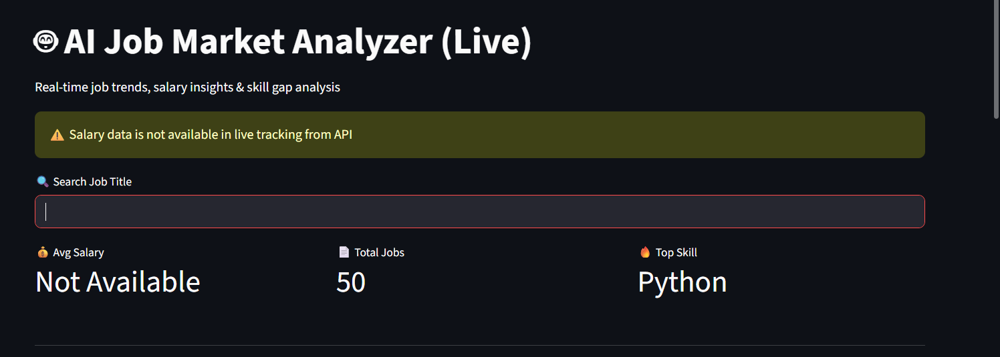
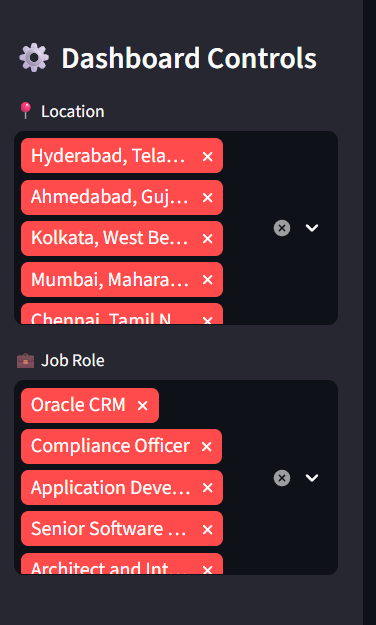
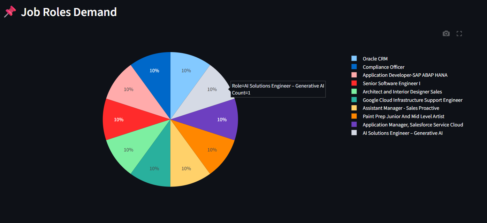
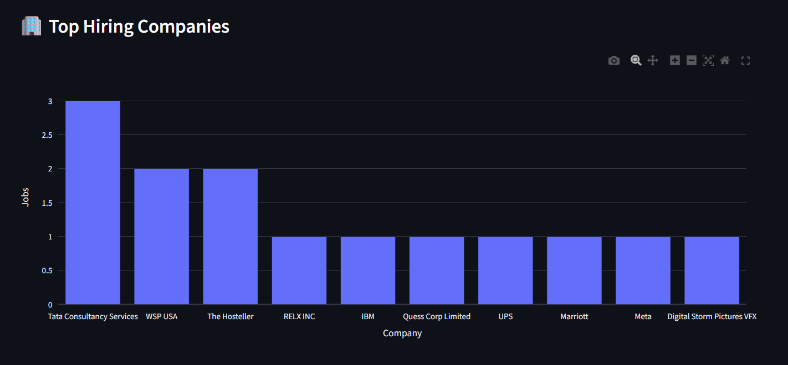
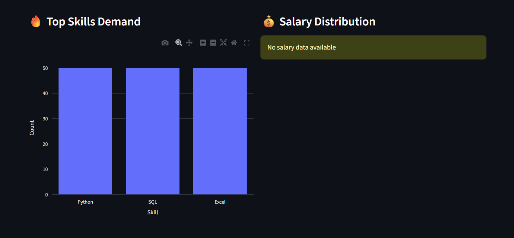

# 🤖 AI Job Market Analyzer (Live)

A real-time job market analytics dashboard built using **Streamlit**, powered by live data from API.

---

## 🚀 Features

- 📊 Real-time job data analysis
- 🔍 Search job roles dynamically
- 🎯 Filter by location and job title
- 💰 Salary insights (with proper handling of missing data)
- 🔥 Top skills demand visualization
- 🏢 Top hiring companies analysis
- 📥 Download filtered job data
- 🧠 Skill gap analysis

---

## 🛠️ Tech Stack

- Python 🐍
- Streamlit
- Pandas
- Plotly
- REST API (Adzuna)

---

## ⚠️ Note

Salary data is not always available from the API.  
Instead of generating fake data, the application displays a proper message to maintain data integrity.

---

## 📸 Screenshots

### 📊 Dashboard


---

### 🎛️ Dashboard Controls


---

### 📌 Job Role Demand


---

### 🏢 Top Hiring Companies


---

### 🔥 Top Skills & Salary


---

## 🌐 Live Demo

([Click Here For Live Demo](https://job-market-analyzer-hzkmrttbadxwfppy7vdikb.streamlit.app/))

---

## 📂 How to Run Locally

```bash
pip install -r requirements.txt
streamlit run app.py
